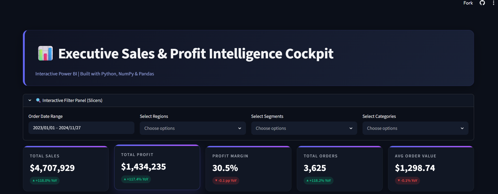
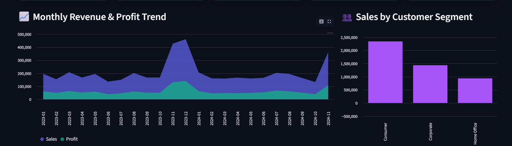
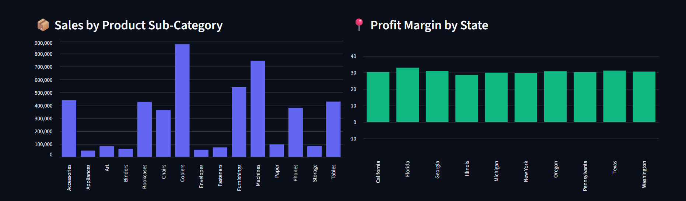

# 📊 Power BI E-Commerce Sales Dashboard — Implementation Guide

> A complete, step-by-step walkthrough for building a professional, high-performance **E-Commerce Sales Dashboard** in Microsoft Power BI Desktop — from raw CSVs to a polished, interactive report.

---

---

## 🚀 Prerequisites & How to Run

Before you start, make sure you have the following ready:

| Requirement | Details |
|---|---|
| **Power BI Desktop** | Free download from [powerbi.microsoft.com](https://powerbi.microsoft.com/desktop/) (Windows only) |
| **Dataset files** | `Dim_Customers.csv`, `Dim_Products.csv`, `Fact_Orders.csv` placed in a local `data/` folder |
| **Power BI account** *(optional)* | Required only if you plan to publish to the Power BI Service |
| **Disk space** | ~200 MB free for Power BI Desktop + workspace cache |

### ▶️ How to Run This Guide

1. **Install Power BI Desktop** if you haven't already (search "Power BI Desktop" in the Microsoft Store, or download the `.exe` from Microsoft).
2. **Create a project folder**, e.g.:
   ```
   ecommerce-dashboard/
   ├── data/
   │   ├── Dim_Customers.csv
   │   ├── Dim_Products.csv
   │   └── Fact_Orders.csv
   └── EcommerceSalesDashboard.pbix   ← you'll create this
   ```
3. **Open Power BI Desktop** → it opens to a blank canvas automatically. No command line or build step is needed; everything below happens inside the Power BI Desktop UI.
4. Follow **Sections 1–4** in order — each step builds on the last (data → model → measures → visuals).
5. Save your file regularly with **Ctrl+S** as `.pbix`.
6. When done, see [Section 5](#5-publishing--sharing) to share or export the finished dashboard.

> 💡 **Tip:** Keep this guide open side-by-side with Power BI Desktop — most steps map directly to ribbon buttons or right-click menus.

---

## 📸 Screenshots

### 🏠 Executive Dashboard Overview



### 📦 Product & Regional Performance Analysis


### 📅 Revenue Trends & Customer Segment Analysis




## 1. Importing the Datasets

1. Open **Power BI Desktop**.
2. Click **Get Data** → **Text/CSV**.
3. Import the three generated CSV files from your `data` folder:
   - `Dim_Customers.csv`
   - `Dim_Products.csv`
   - `Fact_Orders.csv`
4. In the preview window, click **Transform Data** to open the **Power Query Editor**.
5. **Verify and adjust data types:**

   **`Fact_Orders`**
   - `Order_Date`, `Ship_Date` → **Date**
   - `Sales`, `Profit`, `Shipping_Cost` → **Fixed Decimal Number** (Currency)
   - `Quantity` → **Whole Number**
   - `Discount` → **Decimal Number** (Percentage)

   **`Dim_Customers`**
   - `Postal_Code` → **Text** (preserves leading zeros)

   **`Dim_Products`**
   - `Cost_Price`, `List_Price` → **Fixed Decimal Number** (Currency)

6. Click **Close & Apply** to load the data into the model.

✅ **Checkpoint:** You should now see all three tables listed in the **Fields** pane on the right.

---

## 2. Setting Up the Data Model (Star Schema)

Go to **Model View** (relationships icon in the left sidebar) and confirm or create these relationships:

### Core Relationships

| From Table | To Table | Key | Type | Cross-filter |
|---|---|---|---|---|
| `Dim_Customers` | `Fact_Orders` | `Customer_ID` | 1 : Many | Single |
| `Dim_Products` | `Fact_Orders` | `Product_ID` | 1 : Many | Single |

Simply drag the key field from the dimension table onto the matching field in `Fact_Orders` to auto-create each relationship.

### Creating a Date Dimension (`Dim_Date`)

For Month-over-Month, Year-over-Year, and other time-intelligence calculations, build a dedicated date table.

1. In **Report View** or **Data View**, click **New Table** on the ribbon and enter:

   ```dax
   Dim_Date = 
   ADDCOLUMNS(
       CALENDAR(MIN(Fact_Orders[Order_Date]), MAX(Fact_Orders[Order_Date])),
       "Year", YEAR([Date]),
       "Quarter", "Q" & FORMAT([Date], "Q"),
       "Month Number", MONTH([Date]),
       "Month Name", FORMAT([Date], "MMMM"),
       "Month Short", FORMAT([Date], "MMM"),
       "Month-Year", FORMAT([Date], "MMM YYYY"),
       "Month-Year Sort", YEAR([Date]) * 100 + MONTH([Date]),
       "Day of Week", FORMAT([Date], "dddd"),
       "Day of Week Sort", WEEKDAY([Date], 2)
   )
   ```

2. **Fix the sort order** so months and weekdays display chronologically, not alphabetically:
   - Select `Month Name` (or `Month-Year`) → **Sort by column** → `Month-Year Sort`
   - Select `Day of Week` → **Sort by column** → `Day of Week Sort`

3. **Link it to your fact table** in Model View:
   - Drag `Date` (from `Dim_Date`) onto `Order_Date` (in `Fact_Orders`)
   - Type: `1 : Many`, Cross-filter: `Single`

✅ **Checkpoint:** Your model view should now resemble a clean star schema — one fact table in the center, three dimension tables surrounding it.

---

## 3. Writing DAX Measures

Best practice: create a blank, dedicated table to hold all measures (keeps your model organized).

> **Home** → **Enter Data** → name it `_Measures` → **Load** (leave it empty — you'll attach measures to it).

### 🎯 Core KPI Measures

| Measure | DAX | Format |
|---|---|---|
| **Total Sales** | `Total Sales = SUM(Fact_Orders[Sales])` | Currency ($) |
| **Total Profit** | `Total Profit = SUM(Fact_Orders[Profit])` | Currency ($) |
| **Profit Margin %** | `Profit Margin % = DIVIDE([Total Profit], [Total Sales], 0)` | Percentage (%) |
| **Total Orders** | `Total Orders = DISTINCTCOUNT(Fact_Orders[Order_ID])` | Whole Number |
| **Average Order Value** | `Average Order Value = DIVIDE([Total Sales], [Total Orders], 0)` | Currency ($) |
| **Total Quantity Sold** | `Total Quantity Sold = SUM(Fact_Orders[Quantity])` | Whole Number |

### 📈 Time Intelligence / Trend Measures

```dax
Sales LY = CALCULATE([Total Sales], SAMEPERIODLASTYEAR(Dim_Date[Date]))

Sales YoY Growth % = DIVIDE([Total Sales] - [Sales LY], [Sales LY], 0)

Profit LY = CALCULATE([Total Profit], SAMEPERIODLASTYEAR(Dim_Date[Date]))

Profit YoY Growth % = DIVIDE([Total Profit] - [Profit LY], [Profit LY], 0)
```

> ⚠️ **Note:** Time-intelligence functions like `SAMEPERIODLASTYEAR` require a proper, continuous `Dim_Date` table marked as a **Date Table** (right-click `Dim_Date` → **Mark as date table** → select the `Date` column).

✅ **Checkpoint:** All measures should appear under `_Measures` in the Fields pane with a calculator icon.

---

## 4. Dashboard Design & Visual Layout

Build a clean, modern dashboard using the layout below.

### 🎨 Theme & Canvas Setup

| Element | Setting |
|---|---|
| Background (dark mode) | `#1E2229` (dark slate/charcoal) |
| Background (light mode) | `#F8F9FA` |
| Font | Segoe UI or Inter |
| Accent colors | Violet (sales), Cyan/Teal (profit), Green/Red (positive/negative) |

### 🔹 Section 1 — Interactive Slicers (Top Panel)

| Slicer | Field | Style |
|---|---|---|
| Date | `Dim_Date[Date]` | Date range slider |
| Region | `Dim_Customers[Region]` | Dropdown / horizontal tiles |
| Customer Segment | `Dim_Customers[Segment]` | Horizontal buttons/tiles |
| Product Category | `Dim_Products[Category]` | Dropdown |

### 🔹 Section 2 — KPI Cards (Top Row)

Place 5 **Card** visuals side by side:

1. **Total Sales** — `[Total Sales]`
2. **Total Profit** — `[Total Profit]` (conditional font color: green if > 0, red if < 0)
3. **Profit Margin %** — `[Profit Margin %]`
4. **Total Orders** — `[Total Orders]`
5. **AOV** — `[Average Order Value]`

### 🔹 Section 3 — Charts & Analytical Visuals (Main Body)

**Sales & Profit Monthly Trend** *(left, large)*
- Visual: Line and stacked column chart
- X-axis: `Dim_Date[Month-Year]` (sorted chronologically)
- Y-axis: `[Total Sales]` (column), `[Total Profit]` (line, secondary axis)
- Style: zoom slider on, spline lines, violet + teal color pairing

**Sales by Category & Sub-Category** *(right, top)*
- Visual: Clustered horizontal bar chart
- Axis: `Dim_Products[Category]` → `Dim_Products[Sub_Category]` (drill-down enabled)
- Values: `[Total Sales]`, data labels on

**Customer Segment Sales Split** *(right, bottom)*
- Visual: Donut chart
- Legend: `Dim_Customers[Segment]`
- Values: `[Total Sales]`
- Detail labels: category name + percentage

### 🔹 Section 4 — Geographical Distribution (Bottom Row)

**Regional Sales Map** *(left)*
- Visual: Filled map
- Location: `Dim_Customers[State]`
- Bubble size: `[Total Sales]`
- Color saturation: `[Profit Margin %]` (highlights most profitable states)

**Detailed Transactions Table** *(right)*
- Visual: Matrix or Table
- Columns: `Customer_Name`, `Product_Name`, `Category`, `Total Sales`, `Total Profit`, `Profit Margin %`
- Sort: descending by `Total Sales`
- Conditional formatting: data bars on the Sales column

✅ **Checkpoint:** Your canvas should now have 4 visual zones: slicers on top, KPI cards below that, charts in the middle, and map/table at the bottom.

---

## 5. Publishing & Sharing

Once your dashboard is complete:

1. **Save** the file (`Ctrl+S`) as a `.pbix`.
2. To share within an organization:
   - Click **Publish** on the Home ribbon (requires a Power BI account/workspace).
   - Choose your destination workspace and click **Select**.
3. To share as a static file:
   - Send the `.pbix` directly (recipient needs Power BI Desktop installed), **or**
   - Export to PDF via **File** → **Export** → **Export to PDF** for a non-interactive snapshot.

---

## 🛠 Troubleshooting

| Issue | Likely Cause | Fix |
|---|---|---|
| Relationships won't auto-detect | Column names/types don't match exactly | Check both columns are the same data type (e.g., both Text or both Whole Number) |
| `SAMEPERIODLASTYEAR` returns blank | `Dim_Date` not marked as a date table, or date range too short | Mark as date table; ensure `Dim_Date` spans full years |
| Map visual shows no bubbles | Ambiguous state names or missing geocoding | Add a `Country` field for context, or use latitude/longitude columns instead |
| Slicers don't filter visuals | Relationship direction set to "Both" unexpectedly, or visual not in scope | Check relationship cross-filter direction in Model View |
| Numbers show wrong currency symbol | Locale mismatch | Set format explicitly via **Modeling** → **Format** → Currency → choose region |

---

## ✅ Final Checklist

- [ ] All 3 CSVs imported with correct data types
- [ ] Star schema relationships created (`Dim_Customers`, `Dim_Products` → `Fact_Orders`)
- [ ] `Dim_Date` table created and marked as a date table
- [ ] All 10 DAX measures created in `_Measures` table
- [ ] KPI cards, trend chart, category chart, donut chart added
- [ ] Map and detail table added with conditional formatting
- [ ] Slicers tested across all visuals
- [ ] File saved and (optionally) published

---

<p align="center"><i>Built for data-driven decisions. 📈</i></p>
